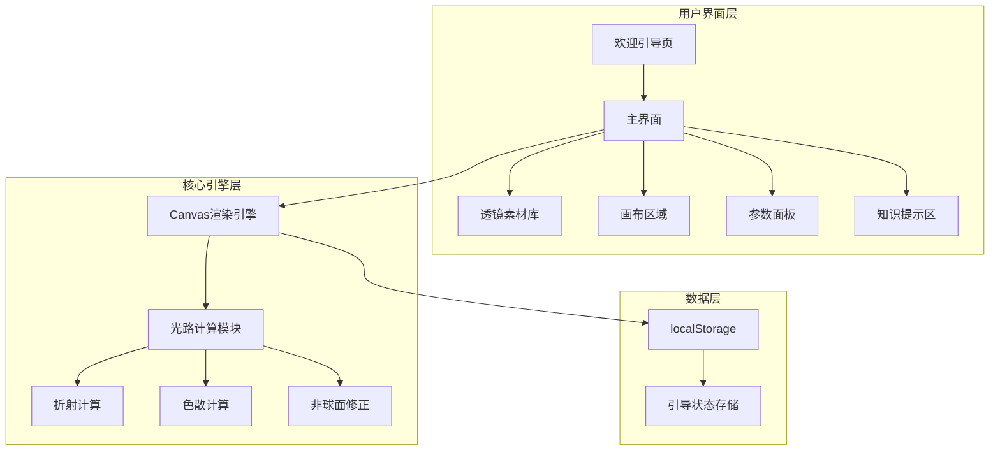
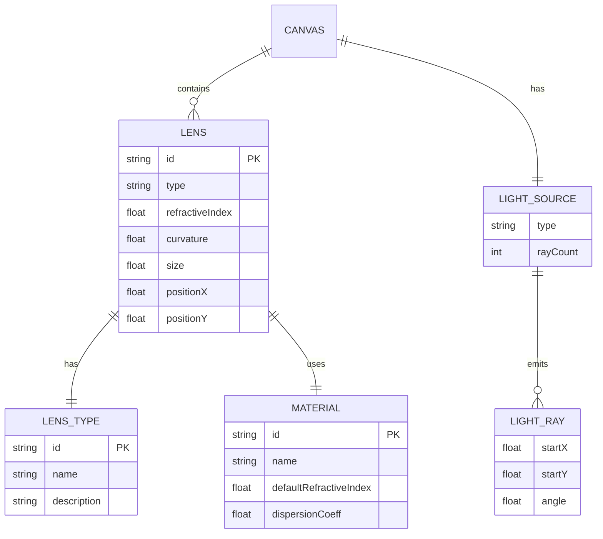
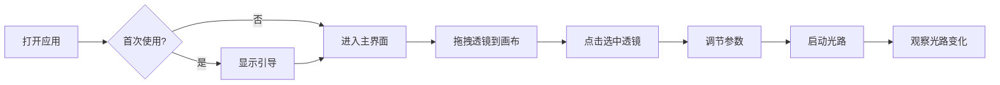

# 中学生交互式光学设计编程项目 - 设计文档

## 一、系统架构



## 二、模块关系图



## 三、核心功能模块

### 3.1 透镜类型与光路规律

| 类型 | 说明 | 光路规律 |
|------|------|----------|
| convex | 凸透镜 | 光线向光轴会聚 |
| concave | 凹透镜 | 光线向外发散 |
| plano | 平面透镜 | 不偏折 |
| aspheric | 非球面透镜 | 精准会聚，消除球差 |

### 3.2 材料类型

| 材料 | 折射率 | 色散系数 | 说明 |
|------|--------|---------|------|
| normal | 1.5 | 0.3 | 普通玻璃 |
| highIndex | 1.7 | 0.25 | 高折射率，更薄更强聚光 |
| lowDispersion | 1.52 | 0.1 | 低色散，减少彩虹光斑 |

## 四、UI/UX 规范

### 4.1 色彩体系

- 主色调: #4A90E2 (蓝色)
- 强调色: #5D7A3A (低饱和绿)
- 页面背景: #F5F2EB (浅米白)
- 卡片背景: #FFFFFF
- 主文本: #333333
- 次文本: #666666
- 成功色: #4A5D23
- 错误色: #783F27

### 4.2 字体规范

- 中文: 思源黑体 / 系统默认无衬线体
- 标题: 18-20px, 字重700
- 正文: 14-16px, 字重500
- 辅助文字: 12px, 字重400

### 4.3 间距规范

- 基础单位: 8px
- 小间距: 8px
- 中间距: 16px
- 大间距: 24px
- 卡片圆角: 8px

### 4.4 交互规范

- 可点击区域: ≥44px × 44px (移动端≥48px)
- 过渡动画: 0.3s ease
- 光路更新: 实时

## 五、响应式断点

| 设备 | 断点 | 布局 |
|------|------|------|
| 手机 | <768px | 纵向布局 |
| 平板 | 768px-1024px | 纵向布局 |
| 电脑 | >1024px | 横向布局 |

## 六、文件结构

```
frontend-user/
├── index.html          # 主入口
├── Dockerfile          # Docker配置
├── css/
│   ├── reset.css       # 样式重置
│   ├── variables.css   # CSS变量
│   ├── layout.css      # 布局样式
│   ├── components.css  # 组件样式
│   └── responsive.css  # 响应式样式
└── js/
    ├── app.js          # 应用入口
    ├── config.js       # 配置常量
    ├── storage.js      # 本地存储
    ├── guide.js        # 引导系统
    ├── canvas.js       # 画布管理
    ├── renderer.js     # 光路渲染
    ├── physics.js      # 物理计算
    ├── interaction.js  # 交互处理
    └── utils.js        # 工具函数
```

## 七、核心交互流程



## 八、光路计算原理

### 8.1 核心规律

- 凸透镜：光线向中间会聚（向光轴偏折）
- 凹透镜：光线向外发散（远离光轴）
- 平面透镜：不偏折
- 非球面：消除球差，边缘光线修正

### 8.2 偏折计算（薄透镜斜率传递）

采用光线传输矩阵（ABCD）中薄透镜的精确形式，对光线【斜率】u = tan θ 做变换：

```javascript
// 近轴光焦度 P（canvas 单位 1/px），近轴焦距 f = 1 / P
power = POWER_FACTOR * (n - 1) * curvature / 100   // POWER_FACTOR = 0.02

// 凸透镜：u' = u - P·h·SA(ρ)   （h 为光线到光轴距离，SA 为球差系数）
// 非球面：u' = u - P·h          （抵消球面 ρ⁴ 项，所有光线严格共点）
// 凹透镜：u' = u + P·h
// 平  面：u' = u
```

由于使用斜率而非小角度叠加，水平平行光出射斜率恰为 −h/f，
任意高度的光线严格在距透镜 f 处与光轴相交（f 即焦点标记位置）；
倾斜平行光会聚于焦平面上的对应点，点光源成像严格满足 1/f = 1/u + 1/v。

### 8.3 球差与非球面

- 球面凸透镜：SA(ρ) = 1 + (0.03 + 0.24·curvature/100)·ρ⁴，边缘光线偏折过度，提前会聚；
  画布用橙色小点标出边缘光线会聚位置，红色 F 为近轴焦点。
- 非球面透镜：表面曲率由中心向边缘逐渐变平缓（偶次非球面方程），
  抵消球面边缘多出的 ρ⁴ 项偏折，边缘光线与中心光线穿过同一焦点。
- 凹透镜的焦点为虚焦点（空心圆点，位于透镜左侧）。

### 8.4 色散模型

不同波长光的折射率不同（柯西公式简化）：
- 蓝光折射率最大，偏折最多
- 红光折射率最小，偏折最少
- 低色散镜片：三色光几乎重合
